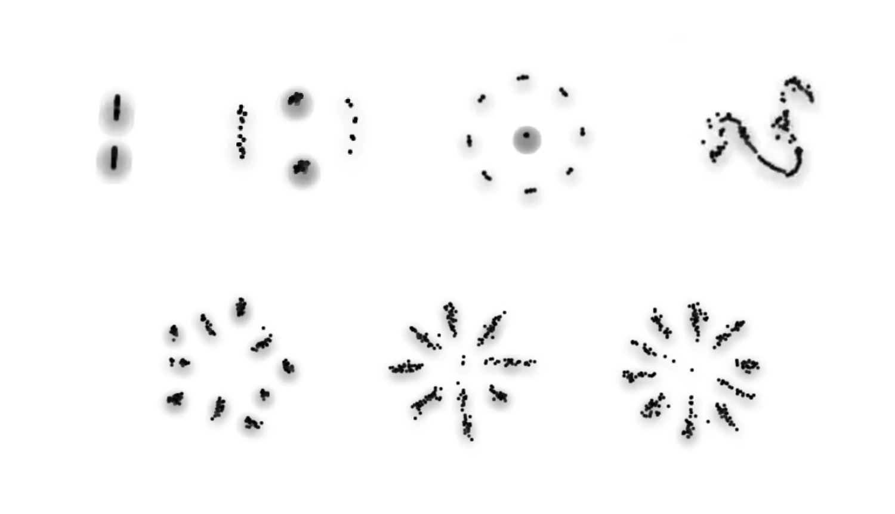
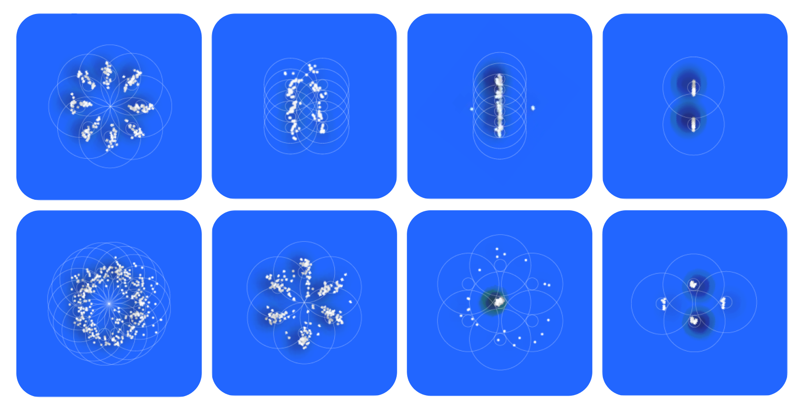

# PGL (Philippe's Game of Life)

Welcome to PGL, a web-based simulation that combines concepts behind Conway's Game of Life and Reynolds' Boids to explore emergent behavior. This guide will help you install, run, and interact with PGL, providing insight into its mechanics and purpose. Drawing from these influences, it creates an environment where virtual particles or 'boids' navigate the canvas driven by simple rules of attraction and repulsion. This project is a metaphorical representation of life and emergence, drawing parallels to the concept of magnetism as a generative force. PGL invites everyone, from developers to curious learners, to explore the captivating dynamics of simulated life, where simple rules lead to complex behaviors. 


By adjusting the parameters of the simulation, you can observe emergent behaviours that mimic patterns seen in nature, science, and even social dynamics.

## Under the Hood

At the center of PGL is a simple algorithm that governs the behaviour of each boid. This algorithm relies on two key factors - repulsion and attraction. These factors, represented by 'R' and 'A' respectively, define how the boids interact with each other. 

The balance between these two factors can be tweaked using sliders in the UI, allowing you to observe different flocking behaviours. The configuration of these settings is represented as a formula string (e.g., "R12 A50 S6 L10 G100") that reflects the current state of the simulation.

## Interacting with PGL

PGL is designed to be interactive. Four primary sliders allow you to adjust key parameters of the simulation: Repulsion Distance, Attraction Distance, Lifespan, and Growth Rate.

- **Repulsion Distance (R)**: This parameter controls the minimum distance that boids try to maintain from each other. Increasing the repulsion distance results in a larger personal space for each boid, causing the flock to spread out.

- **Attraction Distance (A)**: This setting determines the maximum distance within which a boid will try to stay close to its neighbours. A larger attraction distance increases the range within which boids sense and respond to their neighbours, resulting in larger, more cohesive flocks.

- **Lifespan (L)**: This parameter defines the number of update cycles a boid will live for. As the lifespan decreases, boids will disappear more quickly, making the simulation more dynamic and ephemeral.

- **Growth Rate (G)**: This slider controls the rate at which new boids are added to the canvas. A higher growth rate leads to a faster increase in the number of boids, making the simulation more crowded and energetic.

To pause or resume the simulation, simply click the play/pause button. The shuffle button randomizes the repulsion and attraction settings for a different simulation ruleset. You can also toggle the color scheme switch to change between default and alternative color schemes. 



While the underlying rules are simple, the resulting dynamics can be rich, intricate, and full of surprises. So don't be afraid to experiment and explore and edit the code. Happy exploring!

### Installation

To install PGL locally, start by setting up the project on your local machine. Follow these steps:

1. **Clone the Repository**: Use Git to clone the repository to your desired location with the command:
   ```bash
   git clone https://github.com/philippe-page/pgl
   ```
   Replace `https://github.com/philippe-page/pgl` with the actual URL of the PGL repository.


2. **Navigate to the Project Directory**: Change into the project's directory with:
   ```bash
   cd PGL
   ```


3. **Install Dependencies**: Install the necessary dependencies by running:
   ```bash
   npm install
   ```
   This will fetch all the required packages and prepare your project for execution.


4. **Start the Development Server**: Launch the project by executing:
   ```bash
   npm start
   ```
   This command fires up the development server and hosts your application locally.

5. **Access PGL**: Open your web browser and go to `http://localhost:3000` to view the simulation in action. You're now ready to explore the captivating world of PGL.


### Using PGL

The PGL interface is designed with simplicity and exploration in mind. It features a canvas where boids roam, and a control panel that allows you to manipulate the environment's parameters. Here's how to interact with PGL and tailor the experience to your liking:

- **Adjust Simulation Parameters**: Use the sliders in the control panel to modify the repulsion distance, attraction distance, lifespan, and growth rate of the boids. Each adjustment provides immediate feedback on the canvas, showcasing how different settings influence the collective behavior.

- **Pause/Resume Simulation**: Control the flow of time in the PGL universe with the play/pause button. This feature allows you to halt the action to examine the current state or make adjustments and resume to observe the effects.

- **Randomize Settings**: The shuffle button injects an element of unpredictability by randomly altering the repulsion and attraction distances. This function is perfect for when you're seeking inspiration or simply want to be surprised by new patterns.

- **Toggle Color Scheme**: Switch between the default and alternative color schemes to customize the visual aesthetics of the simulation. This toggle can enhance visibility or simply match your personal preference.

## Overview

PGL stands at the confluence of computer science, mathematics, and art, offering a digital canvas where users can simulate and observe flocking behavior akin to that seen in nature. Through a blend of simple rules governing repulsion and attraction, PGL demonstrates how complexity can arise from simplicity. This project not only serves as a tool for entertainment and education but also as a tribute to the beauty of emergent systems and the profound patterns they can reveal.



By engaging with PGL, users gain insights into the foundational principles of life-like systems and the mesmerizing ways in which individual components can work together to create something greater than the sum of its parts.

## Acknowledgements

I extend my heartfelt gratitude to the pioneering work of John Conway and Craig Reynolds, whose inventions have laid the groundwork for this project. A special mention goes to [Bert Chan](https://twitter.com/BertChakovsky), Artificial Life researcher at [Google Deepmind](https://deepmind.google/) behind the Lenia project, and [Hiroki Sayama](https://twitter.com/HirokiSayama) at the [University of Binghamton](https://bingdev.binghamton.edu/sayama/), for their inspirational role in exploring artificial life, and the encouragement of the A-Life community. Through this simple game of life, I hope to honor these contributions and continue the exploration of complex systems and emergent behavior.